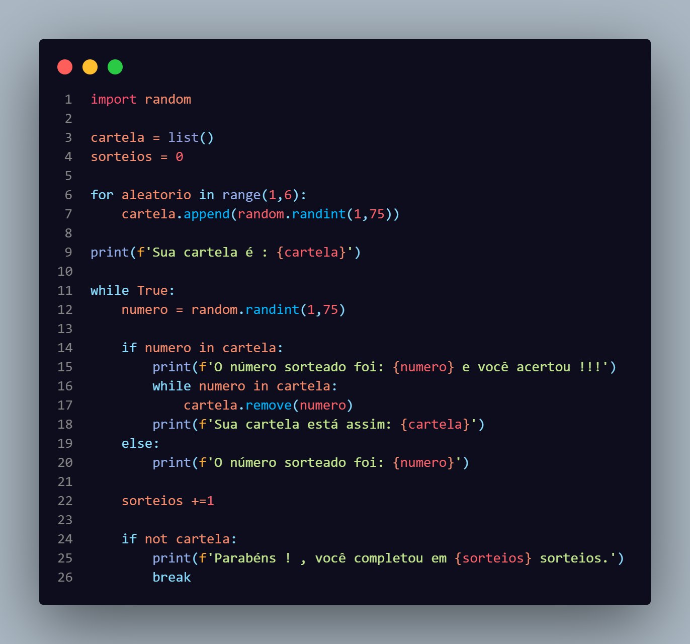
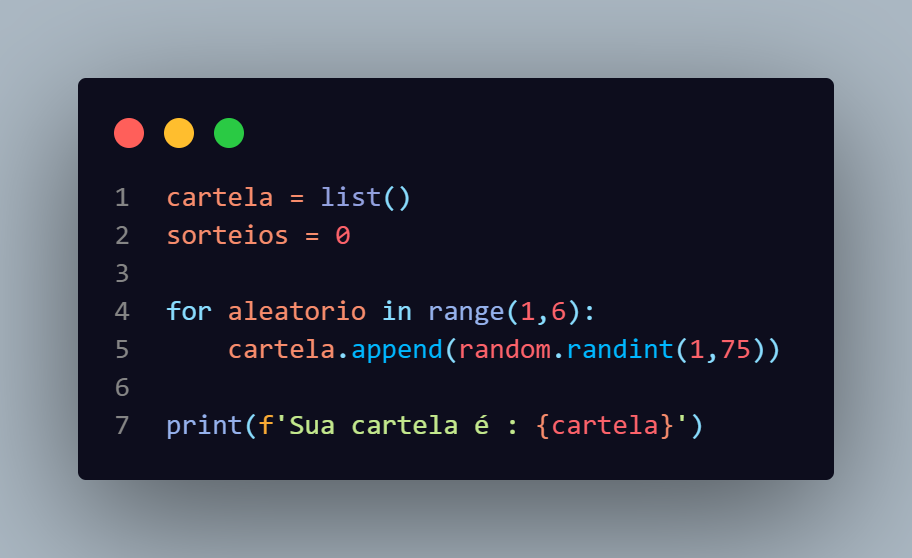
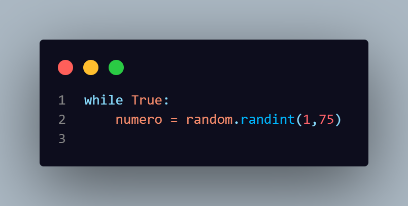
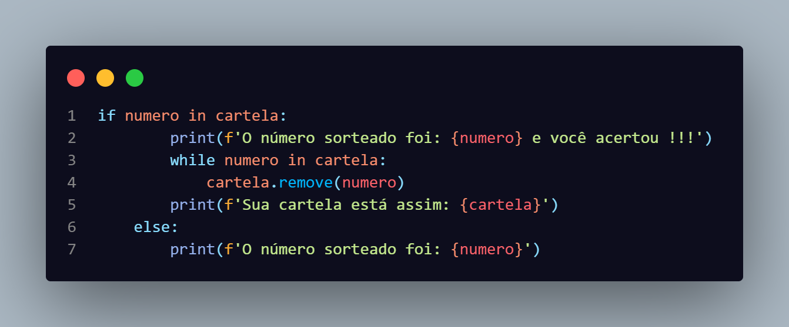
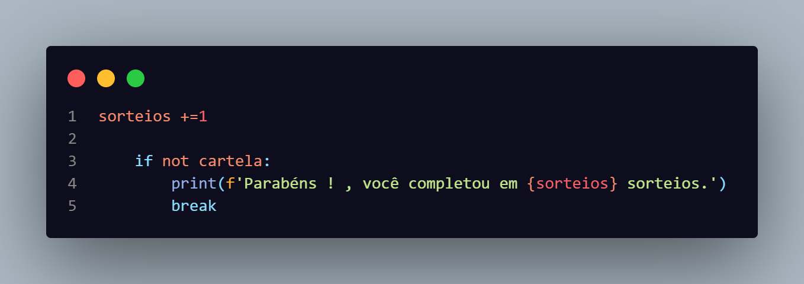
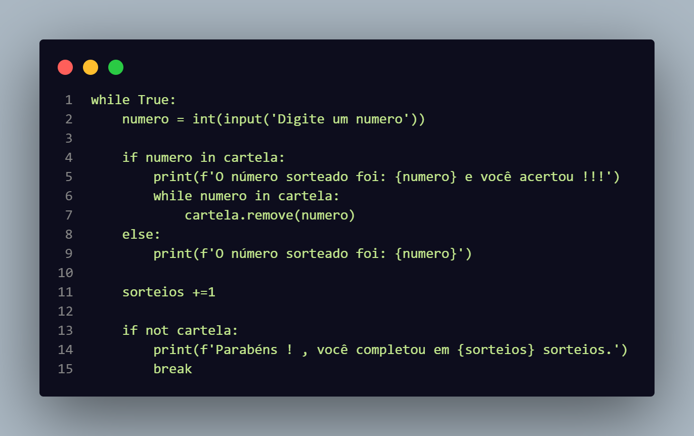

# Explicação do Bingo

### Codigo completo

Cria a cartela e coloca valores aleatorios de 1 à 75 até que tenha 5 valores na cartela

Inicia o loop e gera o primeiro número aleatorio

Verifica se o número está na cartela se ele estiver irá mostar uma menssagem na tela e para não houver erro de ter dois números iguais dentro da cartela eu tenho um while que enquanto tiver o número sorteado dentro da cartela ele irá repetir para apagar esse número

Adiciona 1 ao contador e verifica se a cartela está vazia e quando ela estiver vazia termina o programa

Fiz uma maneira do jogo ser jogado de forma manual e sem mostrar a cartela para o jogador
