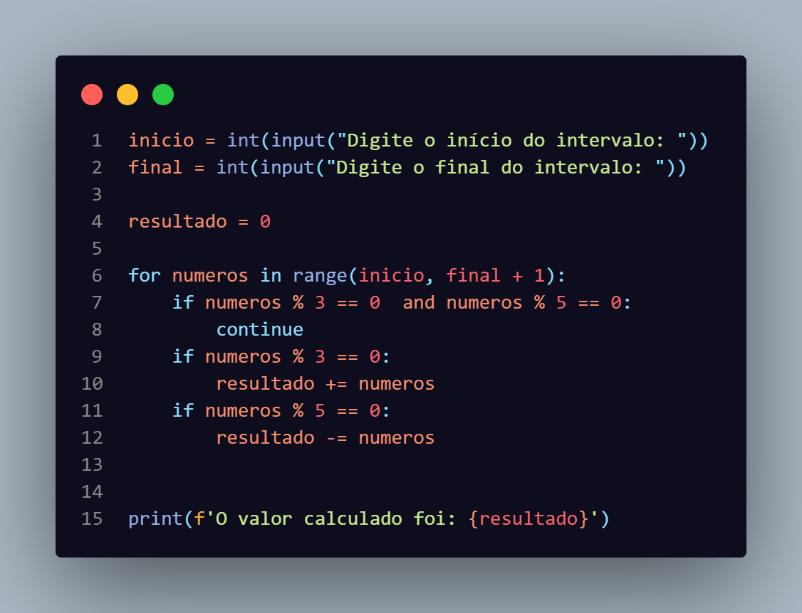
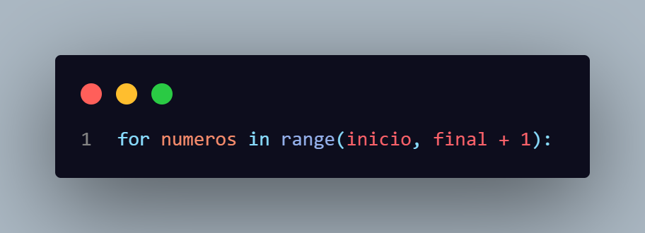
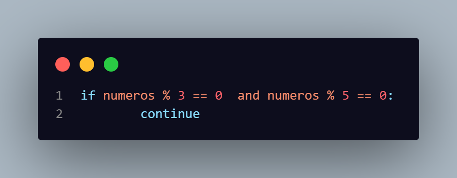
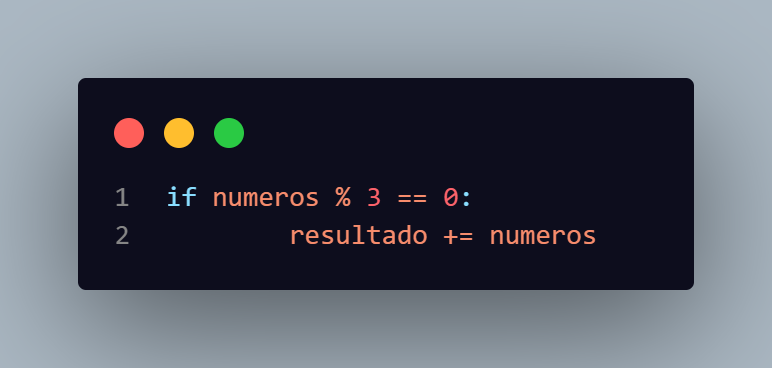
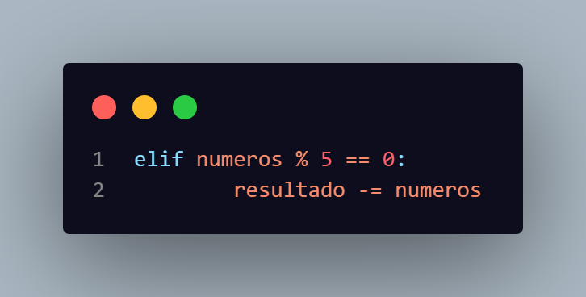
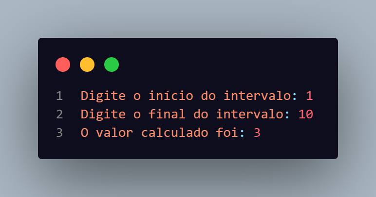
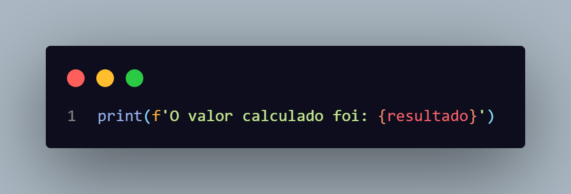

# Explicação do Codigo Secreto

### Codigo completo

O loop inicia com o valor da variável <strong>início</strong> e vai até o valor da variável <strong>final</strong> +1, porque, se não, ele vai até o penúltimo número em vez do último.

Se o número for divisível por 3 e 5, o código não faz nada e apenas segue em frente para a próxima condição.

Testo se é divisível por 3 e, se for, somo ao resultado usando +=.

Faço o mesmo teste, só que agora verifico se é divisível por 5 e, se for, subtraio usando -=.

Input dos dados.

Mostro o resultado.

