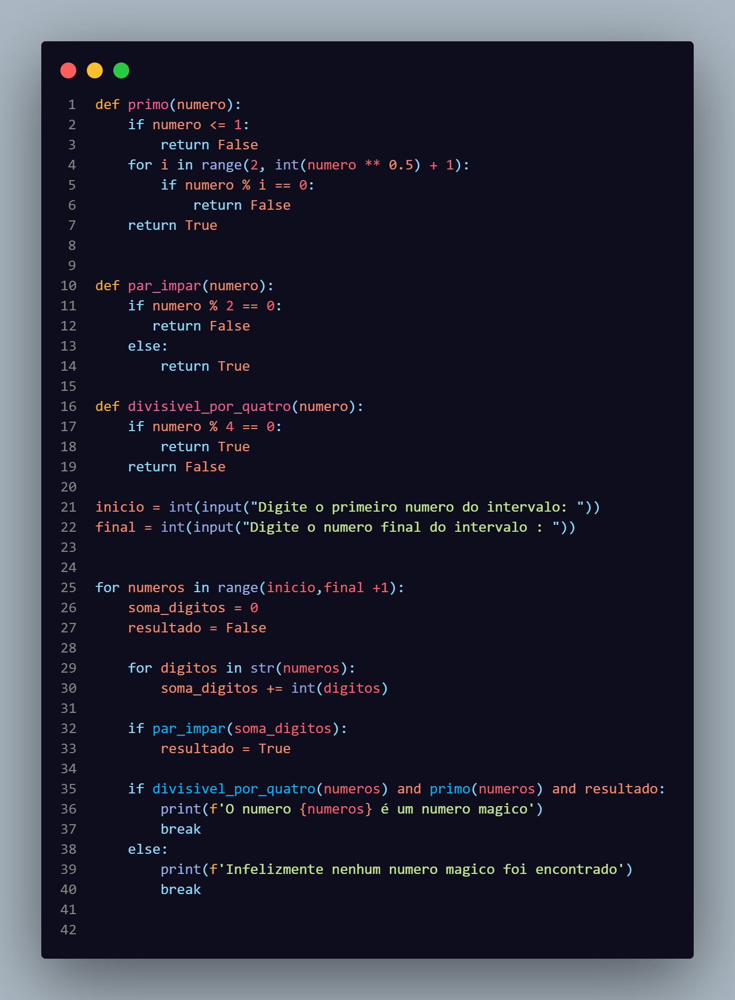
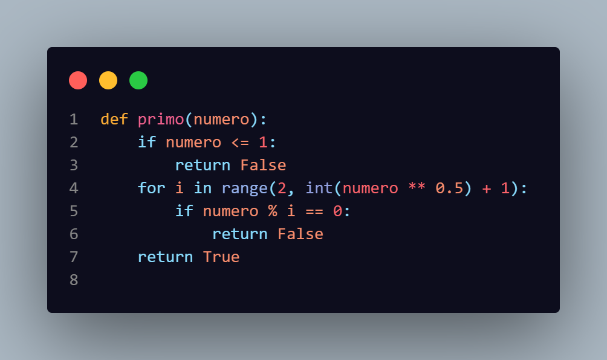
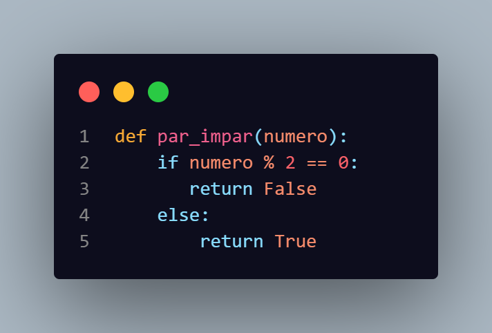
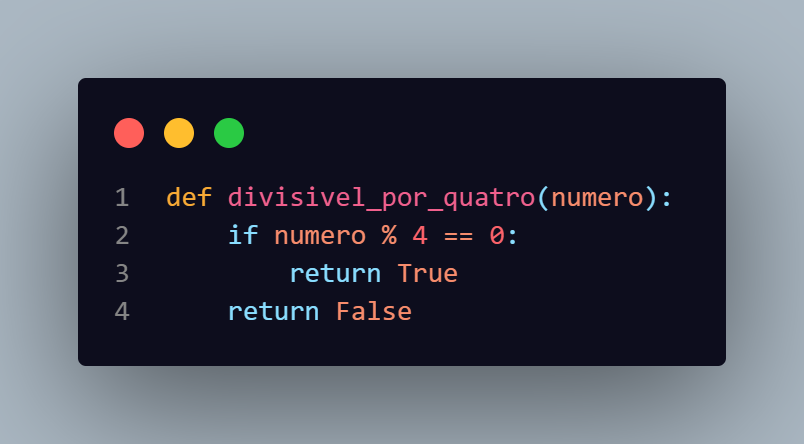
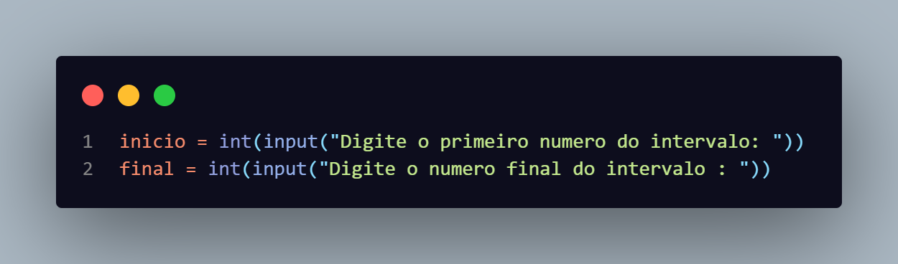
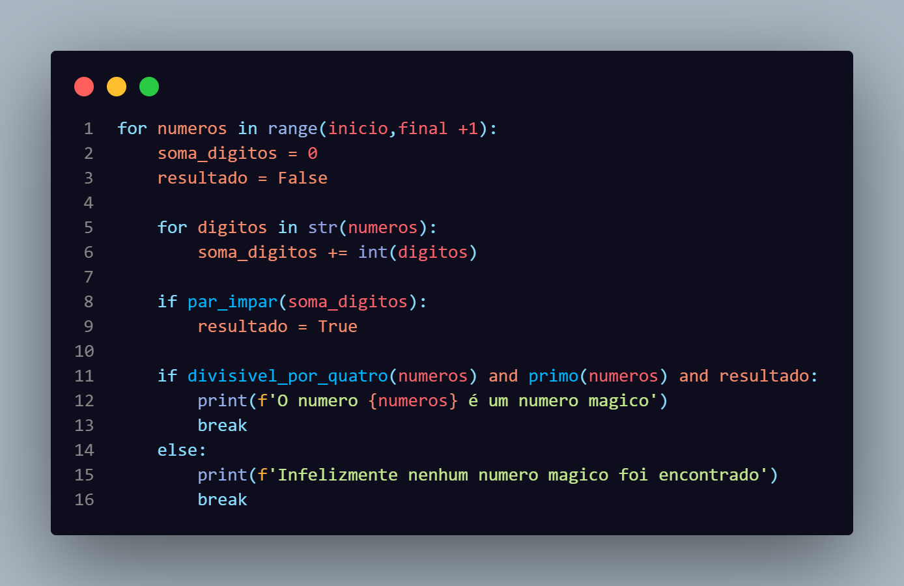
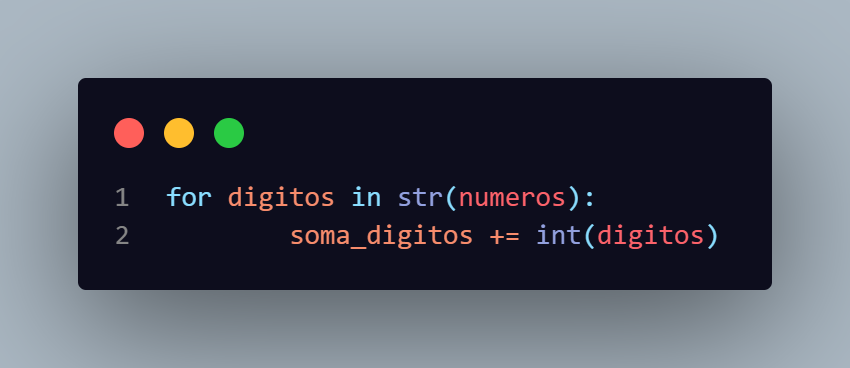
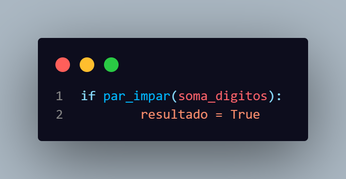

# Explicação do Numero magico

### Codigo completo

<h3>Função numero primo</h3>

<h3>Função Primo ou Impar</h3>

<h3>Função divisivel por quatro</h3>

Input dos dados

Loop

A variavel <strong>soma_digitos</strong> começa com zero para que depois seja somado o valor de cada digito usando o for 

Depois disso eu testo se a soma dos digitos da impar e se for adiciono True a minha variavel resultado

Por fim testo se é divisivel por quatro , se é primo e se o resultado é verdadeiro

<h2>Indentificação do numero magico</h2>

Mesmo depois de fazer todo o código e começar a testar com números grandes, nunca encontrava um número mágico. Depois de reler o que foi pedido, percebi que não há como existir um número mágico que atenda aos requisitos, porque ele sendo divisível por quatro faz ele não ser primo 
